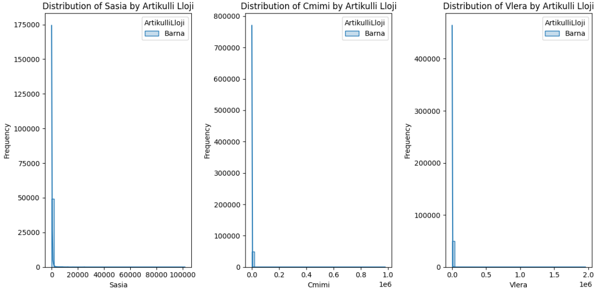

# Shpenzueshmëria e barnave për nivelin dytësor dhe terciar në vitin 2024

## Përmbledhje**

**Titulli i projektit:** *Shpenzueshmëria e barnave për nivelin dytësor dhe terciar në vitin 2024*

**Universiteti:**
UNIVERSITETI I PRISHTINËS “HASAN PRISHTINA

**Fakulteti:**
Fakulteti i Inxhinierisë Elektrike dhe Kompjuterike

**Drejtimi:**
Inxhinieri Kompjuterike dhe Softuerike

**Lënda:**
Machine Learning

**Mësimdhënësit e lëndës:**

| Emri                   | Roli          | Fakulteti                                           |
|------------------------|---------------|-----------------------------------------------------|
| Prof. Dr. Lule AHMEDI  | Professor     | Fakulteti i Inxhinierisë Elektrike dhe Kompjuterike |
| Dr. Sc. Mërgim H. HOTI | Asistent      | Fakulteti i Inxhinierisë Elektrike dhe Kompjuterike |

 **Studentët:**

| Emri             | Roli             | Fakulteti                                           |
|----------------  |------------------|-----------------------------------------------------|
| Arben Krivenjeva | Master Student   | Fakulteti i Inxhinierisë Elektrike dhe Kompjuterike |
| Muhamet Burrniku | Student          | Fakulteti i Inxhinierisë Elektrike dhe Kompjuterike |
| Bledian Potera   | Student          | Fakulteti i Inxhinierisë Elektrike dhe Kompjuterike |

Ky projekt po realizohet në Universitetin e Prishtinës, specifikisht në Fakultetin e Inxhinierisë Elektrike dhe Kompjuterike, si pjesë e programit të studimeve të nivelit Master, në semestrin e dytë, në vitin akademik 2024/2025.

Objektivi kryesor i këtij projekti është zhvillimi i një modeli të fuqishëm të Mësimit të Makinerive, i cili do të jetë në gjendje të parashikojë me saktësi shpenzueshmërinë e barnave nëpër spitale dhe klinika, bazuar në parametra të ndryshëm si vlera e buxhetit, numri i klinikave/reparteve, llojet e artikujve, etj.

Të dhënat e përdorura për këtë projekt përmbajnë informacion mbi shpenzueshmërinë e barnave në aspektin sasior dhe monetar për nivelin dytësor dhe tretësor në vitin 2024, të ndara sipas spitaleve, klinikave/reparteve, llojeve të artikujve dhe operatorëve ekonomikë.

Duhet theksuar se këto të dhëna nuk përmbajnë asnjë informacion të ndjeshëm që mund të rrezikojë anonimitetin ose privatësinë.

## **Fazat e projektit**

**Faza I - Përgatitja e modelit:**
- Analiza Eksploruese e të Dhënave
- Para-procesimi për përgatitjen e të dhënave për analizë
   - Trajtimi i vlerave të zbrazëta
   - Pastrimi i të dhënave
   - Tipet e të dhënave
   - Reduktimi i Dimensionalitetit
   - Standartizimi, diskretizimi dhe binarizimi, 
   - Vizualizimi
   - Gjetja dhe fshirja e Outliers
- Ndarja e të dhënave sipas niveleve

**Faza II - Trajnimi i modelit:**
- Para-procesimi i të Dhënave: Sigurimi që veçoritë janë të përshtatshme për modelin e Machine Learning, përfshirë kodimin e variablave kategorikë dhe shkallëzimin e të dhënave numerike.
- Trajnimi i Modelit: Përdorimi i një algoritmi të përshtatshëm për klasifikimin dhe parashikimin e shpenzueshmërisë së barnave, duke marrë parasysh buxhetin, numrin e reparteve/klinikave dhe llojet e barnave.
- Vlerësimi i Modelit: Matja e saktësisë dhe efektivitetit të modelit me metrika të përshtatshme për parashikimin e shpenzueshmërisë së barnave.

**Faza III - Analiza dhe evaluimi (ri-trajnimi) dhe aplikimi i veglave të ML:**
- Rregullimi i Hiperparametrave: Eksperimentimi me parametra të ndryshëm për të optimizuar performancën e metodave të analitikës së të dhënave, duke siguruar klasifikime dhe parashikime më të sakta.
- Ritrajnimi i Modeleve: Përdorimi i konfigurimeve optimale për të përmirësuar rezultatet në:
   - Klasterizimin (K-Means) për të grupuar spitalet sipas modeleve të ngjashme të shpenzueshmërisë së barnave.
   - Analizën e Asocimit (Apriori, FP-Growth) për të zbuluar modelet e përdorimit të barnave dhe mungesat në spitale të ndryshme.
   - Klasifikimin (Random Forest, Decision Trees) për të parashikuar përdorimin e barnave në spitale bazuar në faktorë të ndryshëm.
   - Regresionin (Linear, Ridge, Lasso) për të modeluar dhe parashikuar shpenzimet për barna të ndryshme.
- Krahasimi i Performancës: Matja dhe krahasimi i efektivitetit të metodave të ndryshme duke përdorur metrika për saktësinë e grupeve (clustering), rregullsinë e rregullave të asocimit, saktësinë dhe kujtesën për klasifikim, si dhe gabimet e parashikimit për regresion.
- Vizualizimi i Rezultateve: Krijimi i grafikëve për të analizuar më mirë modelet e shpenzueshmërisë së barnave dhe ndikimin e parametrave në rezultatet e metodave të përdorura.
- Analiza e Parametrave: Krahasimi i konfigurimeve më të mira dhe më të këqija për secilën metodë, duke vlerësuar ndikimin e hiperparametrave në performancën e analizës dhe parashikimeve.

## ** Faza I - Analiza Eksploruese e të Dhënave**

**Madhësia e dataset** Të dhënat përmbajnë 54,161 rreshta dhe 13 kolona.

**Kolonat**: Dataset përmban kolonat: Spitali, NjesiaReparti, Numri, Shenim, DataRegjistrimit, Artikulli, ArtikulliLloji, RrugaMarrjes, Sasia, Cmimi, Vlera, OperatoriEkonomik, LlojiHyrjes

 **Tipet e të dhënave**: Atributet që përmbajnë tekst (Spitali, NjesiaReparti, Numri, Shenim, DataRegjistrimit, Artikulli, ArtikulliLloji, RrugaMarrjes, OperatoriEkonomik, LlojiHyrjes) janë në formatin e tipit object, ndërsa atributet që përmbajnë numra (Sasia, Cmimi, Vlera) janë në formatin e tipit float.

 **Kuptimi i të gjitha kolonave Para-procesimit**
 1. **Spitali**: Spitali i cili i takon nivelit dytësor ose terciar
 2. **Klinika/Repart**: Klinikë ose repart, në varësi të organizimit që ka spitali
 3. **Numri**: Numër rendor i transaksionit sipas njësisë organizative të spitalit
 4. **Shenim**: Një shënim ose koment për atë transaksion
 5. **DataRegjistrimit**: Data e regjistrimit të transaksionit
 6. **Artikulli**: Emërtimi i produktit, i cili është produkt gjenerik dhe përmban detajet e tij
 7. **ArtikulliLloji**: Lloji i produktit ndahet në tri kategori: barna, citostatikë dhe reagentë
 8. **RrugaMarrjes**: Rruga e marrjes është mënyra e përdorimit të produktit farmaceutik nga pacienti
 9. **Sasia**: Sasia e produkteve e shprehur në doza
 10. **Cmimi**: Çmimi i produktit, i cili përfaqëson çmimin njësi për dozë
 11. **Vlera**: Vlera e produktit si rezultat i shumëzimit të sasisë me çmimin
 12. **OperatoriEkonomik**:Ruhen të dhënat për operatorin ekonomik
 10. **LlojiHyrjes**: Lloji i hyrjes së produktit, që përfaqëson burimin e financimit të produktit

## **Para-procesimi**

**Formati fillestar i fajllit**

Fajlli fillestar është në format '.xlsx', i cili, para ngarkimit në projekt, konvertohet në një fajll '.csv'.

Atributet që përmbajnë tekst (Spitali, NjesiaReparti, Numri, Shenim, DataRegjistrimit, Artikulli, ArtikulliLloji, RrugaMarrjes, OperatoriEkonomik, LlojiHyrjes) janë në formatin e tipit object, ndërsa atributet që përmbajnë numra (Sasia, Cmimi, Vlera) janë në formatin e tipit float.

**Vlera me gabime NULL**
- *Artikulli* ka një rresht me vlerë të munguar (NULL)
  - Trajtimi: Ky rresht është fshirë, pasi përveç artikullit, edhe kolonat e tjera si Sasia, Çmimi dhe Vlera kishin vlera (NULL).
- *Sasia* ka 33 rreshta me vlerë të munguar (NULL)
  - Trajtimi: Këto rreshta janë fshirë, pasi, përveç sasisë, edhe kolonat e tjera si Çmimi dhe Vlera kishin vlera të mungueshme (NULL)
- *Cmimi* ka 33 rreshta me vlerë të munguar (NULL)
  - Trajtimi: Këto rreshta janë fshirë, pasi, përveç çmimit, edhe kolonat e tjera si Sasia dhe Vlera kishin vlera të mungueshme (NULL)
- *Vlera* ka 30 rreshta me vlerë të munguar (NULL)
  - Trajtimi: Këto rreshta janë fshirë, pasi, përveç vlerës, edhe kolonat e tjera si Sasia dhe Çmimi kishin vlera të mungueshme (NULL)

Pra, të gjitha këto kolona me vlera të mungueshme (NULL) kanë qenë njëkohësisht në të njëjtët rreshta. Si rezultat, kemi fshirë gjithsej 33 rreshta për kolonat Artikulli, Sasia, Çmimi dhe Vlera.

### **Para-procesimi i atributeve**

**DataRegjistrimit**

Në kolonën Data e Regjistrimit, formati i datave është rregulluar duke u standardizuar në formatin "yyyy-mm-dd".

**Kolonat Sasia, Cmimi, Vlera**

Për kolonat Sasia, Çmimi dhe Vlera, është formatuar që të shfaqen me dy shifra pas pikës dhjetore.

### **Reduktimi i dimensioneve**

Atributet në vijim janë larguar nga dataset-i, pasi nuk kishim ndonjë interes për t'i përdorur më vonë:

1. Numri
2. Shenim
3. RrugaMarrjes

Në vazhdim paraqesim kolonat që kanë mbetur pas largimit të kolonave të panevojshme dhe pas renditjes së tyre: 
1. Spitali
2. NjesiaReparti
3. LlojiHyrjes
4. OperatoriEkonomik
5. DataRegjistrimit
6. Artikulli
7. ArtikulliLloji
8. Sasia
9. Cmimi
10. Vlera

### Standartizimi, diskretizimi dhe binarizimi

**Standartizimi**

Standartizimi është aplikuar për kolonat Sasia, Çmimi dhe Vlera, duke reduktuar përhapjen e të dhënave dhe duke i sjellë ato në një shkallë të krahasueshme. Të dhënat fillestare përmbanin vlera të ndryshme ekstreme (max: 101,800 për Sasia dhe 979,616 për Çmimin), ndërsa pas normalizimit janë sjellë në një formë më të balancuar.

**Diskretizimi**

Diskretizimi është zbatuar për Sasia, Çmimin dhe Vlerën, duke i ndarë ato në kategori të dallueshme si "E vogël", "Mesatare", "E ulët" etj. Ky proces ndihmon në thjeshtimin e të dhënave duke grupuar vlerat numerike në intervale, duke e bërë analizën më të kuptueshme.

**Binarizimi**

Binarizimi është zbatuar duke përdorur mesataren e kolonës "Vlera" si prag ndarës, ku vlerat më të mëdha se mesatarja kategorizohen si 1, ndërsa ato më të vogla si 0. Ky proces ndihmon në thjeshtimin e analizës dhe përmirësimin e performancës së modeleve klasifikuese. Kjo metodë është veçanërisht e dobishme për dallimin e vlerave të larta dhe të ulëta në mënyrë të strukturuar.

### Vizualizimi

**Cilesia e të dhënave**

Në tabelën e mëposhtme kemi paraqitur cilësinë e të dhënave për të gjitha kolonat e dataset-it, duke treguar vlerat me gabime, vlerat unike, vlerat e duplikuara, mesataren, medianën, devijimin standard, vlerën minimale dhe vlerën maksimale.

**Matrica e korelacionit**

Matrica e korelacionit tregon lidhjen midis Sasisë, Çmimit dhe Vlerës. Çmimi dhe Vlera kanë një korelacion të moderuar (0.58), që tregon se çmimi ndikon më shumë në vlerën totale sesa sasia. Ndërkohë, Sasia dhe Çmimi nuk kanë ndonjë lidhje domethënëse (-0.0017), duke sugjeruar që ndryshimet në çmim nuk ndikojnë drejtpërdrejt në sasinë e produkteve të përdorura.

**Shpenzueshmeria e barnave sipas muajve**

Grafiku tregon një shpërndarje të qëndrueshme të shpenzueshmërisë mujore të barnave, me luhatje midis 3500 dhe 5000 rasteve. Kulmet ndodhin në korrik dhe tetor, ndërsa janari shënon vlerën më të ulët. Luhatjet e vogla në qershor dhe shtator mund të lidhen me faktorë sezonalë. Në përgjithësi, shpenzimet mbeten relativisht të balancuara gjatë vitit.

**Shpenzueshmeria e barnave sipas burimit të financimit**

Grafiku tregon se granti qeveritar është burimi kryesor i financimit, duke tejkaluar 35 milionë, ndjekur nga donacionet me rreth 12 milionë. Hyrjet vetanake dhe pagesat me para të gatshme përfaqësojnë një pjesë shumë të vogël të totalit.

**Shpenzueshmeria e barnave sipas operatoreve**

Grafiku paraqet shpërndarjen e vlerës totale sipas operatorëve ekonomikë, duke treguar se disa operatorë kanë një dominim të lartë në shpenzime. Disa prej tyre kanë vlera shumë të larta, ndërsa shumica kanë një ndikim më të vogël. Operatorët me vlera ekstreme mund të përfaqësojnë furnitorët kryesorë të barnave dhe materialeve mjekësore.

**Shpenzueshmeria e barnave sipas llojeve te produkteve**

Grafiku tregon shpërndarjen e shpenzimeve totale sipas llojit të artikullit, ku barnat zënë pjesën më të madhe të vlerës, duke tejkaluar 35 milionë. Citostatikët përfaqësojnë shpenzime dukshëm më të ulëta, ndërsa reagentët kanë ndikimin më të vogël. Kjo sugjeron se shumica e financimeve shkojnë për barnat, të ndjekura nga trajtimet onkologjike dhe analizat laboratorike.

**Shpenzueshmeria e barnave sipas spitaleve**

Grafiku tregon shpërndarjen e shpenzimeve totale sipas spitaleve, ku Spitali 1 ka një dominim të theksuar, duke kaluar 40 milionë, ndërsa të tjerët kanë shpenzime më të vogla.

**Shpenzueshmeria e barnave sipas Klinikave/Reparteve**

Grafiku tregon shpërndarjen e shpenzimeve totale sipas njësive/reparteve spitalore, ku Onkologjia, Infektivi dhe Pediatria kanë shpenzimet më të larta. Repartet e tjera kanë vlera shumë më të ulëta, duke treguar një fokus të madh të financimeve në trajtimet për kancer, sëmundjet infektive dhe kujdesin pediatrik.

**Vizualizimi i Smote_Algoritem**

Grafiku paraqet shpërndarjen e klasave përpara dhe pas përdorimit të SMOTE për balancimin e të dhënave. Para SMOTE, shumica e vlerave ishin të përqendruara në intervalin 0-1, duke krijuar një shpërndarje të pabalancuar. Pas SMOTE, klasat janë bërë më uniforme, duke përmirësuar ekuilibrin dhe duke ndihmuar modelin të mësojë më mirë nga të gjitha kategoritë.

### Outliers

Grafiku tregon shpërndarjen e Sasisë, Çmimit dhe Vlerës, duke identifikuar outliers (vlera jashtëzakonisht të larta) në të gjitha kategoritë. Sasia ka disa vlera ekstreme mbi 100,000, ndërsa çmimi dhe vlera gjithashtu kanë disa raste me shuma shumë të larta.

### Skewness Data

Grafiku paraqet shpërndarjen e sasive, çmimeve dhe vlerave për kategorinë “Barna”. Të dhënat tregojnë një shpërndarje shumë të anuar djathtas (skewness shumë të lartë), duke treguar se shumica e vlerave janë të vogla, ndërsa disa raste kanë vlera jashtëzakonisht të larta. Kjo tregon praninë e outliers ose vlerave ekstreme, veçanërisht te çmimi (Cmimi) dhe vlera totale (Vlera)

